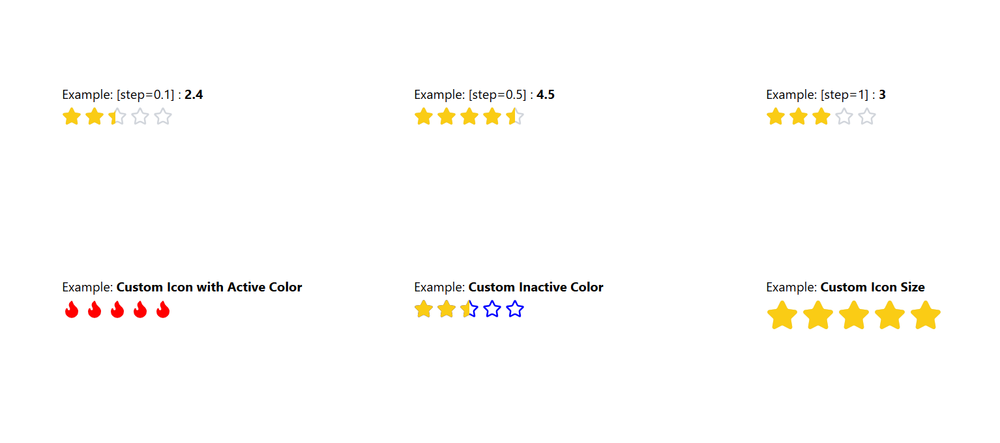

# ⭐️ React Smart Rating

[](https://www.npmjs.com/package/react-smart-rating)
[](https://www.npmjs.com/package/react-smart-rating)
[](./LICENSE)
[](https://react.dev/)
[](https://www.typescriptlang.org/)

A lightweight, fully customizable **React rating component** with support for **fractional ratings**, **custom icons**, **color customization**, and **read-only mode**.  
Perfect for product reviews, feedback forms, or any app that needs a modern, flexible rating UI.

---

## 🚀 Features

-   ⭐ **Fractional Ratings** (e.g. `4.3`, `2.7`)
-   ⚙️ **Customizable Icons** — use any React icon (Lucide, Heroicons, FontAwesome)
-   🎨 **Custom Colors & Sizes**
-   🔒 **Read-only Mode**
-   🧩 **TypeScript Support**
-   💡 **Lightweight** — under 8KB and no external dependencies (except React)

---

## 📦 Installation

React Smart Rating works seamlessly with npm, yarn, and pnpm — choose your favorite package manager 👇

| Package Manager | Command                        |
| --------------- | ------------------------------ |
| **npm**         | npm install react-smart-rating |
| **pnpm**        | pnpm add react-smart-rating    |
| **yarn**        | yarn add react-smart-rating    |

## 📸 Demo



## 🧠 Quick Usage

```bash
  import { ReactSmartRating } from "react-smart-rating";
  import { Heart } from "lucide-react";

  export default function Example() {
    const [rating, setRating]= useState(5)
    return (
      <div>
        {/* Default */}
        <ReactSmartRating initialRating={rating} onChange={(v) => setRating(v)} />

        {/* Half-step */}
        <ReactSmartRating step={0.5} />

        {/* Custom icon */}
        <ReactSmartRating icon={Heart} activeColor="red" step={0.5} />

        {/* Read only */}
        <ReactSmartRating initialRating={rating} readOnly />
      </div>
    );
  }
```

## ⚙️ Props

| Prop            | Type                       | Default   | Description                        |
| --------------- | -------------------------- | --------- | ---------------------------------- |
| `totalStars`    | `number`                   | `5`       | Total number of rating icons       |
| `initialRating` | `number`                   | `0`       | Initial (float) rating value       |
| `readOnly`      | `boolean`                  | `false`   | Disable interactions if true       |
| `onChange`      | `(rating: number) => void` | —         | Callback fired when rating changes |
| `icon`          | `React.ElementType`        | `Star`    | Custom icon component              |
| `activeColor`   | `string`                   | `#facc15` | Color for filled stars             |
| `inactiveColor` | `string`                   | `#d1d5db` | Color for empty stars              |
| `size`          | `number`                   | `24`      | Icon size in pixels                |
| `step`          | `number`                   | `1`       | Rating step step (1, 0.5, 0.1)     |

## 🧩 Example with Fractional Rating

```bash
<RatingStar totalStars={5} initialRating={3.7} step={0.1} readOnly />
```

## 🪶 License

This project is licensed under the MIT License — see the [LICENSE](https://github.com/NiharMondal/react-smart-rating/tree/main?tab=MIT-1-ov-file) file for details.

Made with ❤️ by [Nihar Mondal](https://www.github.com/NiharMondal)
